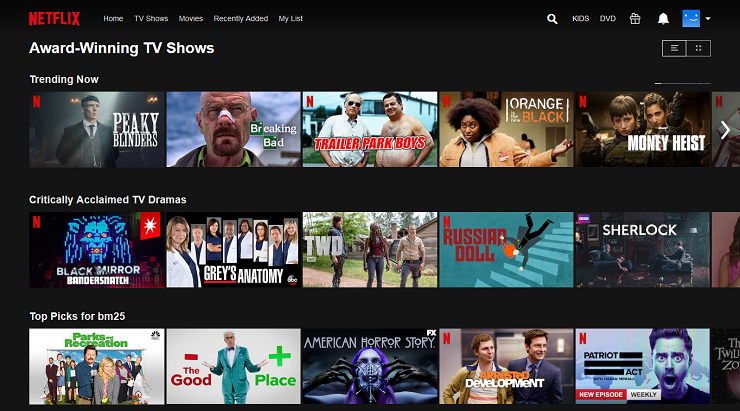

 
  

<h1 align="center"> Netflix Movies And TV Shows Recommender System  </h1>
<h3 align="center"> AlmaBetter Verfied Project - <a href="https://www.almabetter.com/"> AlmaBetter School </a> </h5>

 
  

We have Builed Netflix Movies And TV Shows recommender system in Google Colab which recommends 5 movies based on input movie using cosin similarity.

<h2> :floppy_disk: Project Files Description</h2>

<h4>Executable Files:</h4>
<ul>
  <li><b>MODEL.ipynb</b> - Includes all functions required for classification operations.</li>
</ul>

<h4>Output:</h4>
<ul>
  <li><b>Google Colab</b> - All the outputs are visible in the provided colab notebook.
</ul>

<h4>Data Source:</h4>
<ul>
  <li><b>Dataset</b> - https://www.kaggle.com/datasets/tmdb/tmdb-movie-metadata</li>
</ul>

<h2> :book: Business Problem And Objective </h2>

<h2> :book: About Dataset </h2>

                  
                  

<h2> :clipboard: Execution Instruction</h2>

The order of execution of the colab notebook is as follows:

<b>1) MODEL.ipynb</b>

First, click on the open in colab button present on the top center of the notebook.

<b>2) Kaggle Dataset</b>

Downlaod the dataset from kaggle through provided link.Then, connect to the runtime and execute the cell to mount the drive or upload the data file to the current runtime.

<b>3) Cell Path</b>

Finally, delete the path in the dataset loading cell and replace it with the path of your current data file. Run each cell to see the output below it.

<!-- CREDITS -->
<h2 id="credits"> :scroll: Credits</h2>

Vivek Pawar | Avid Learner | Data Scientist | Machine Learning Engineer 

 <i> Contact me for Data Science Project Collaborations</i>

